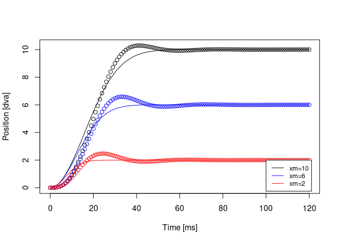
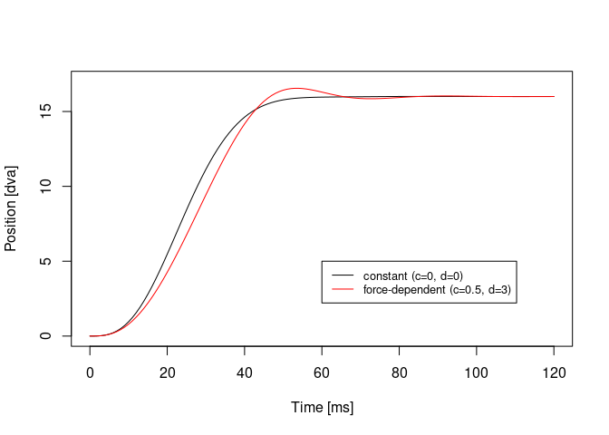
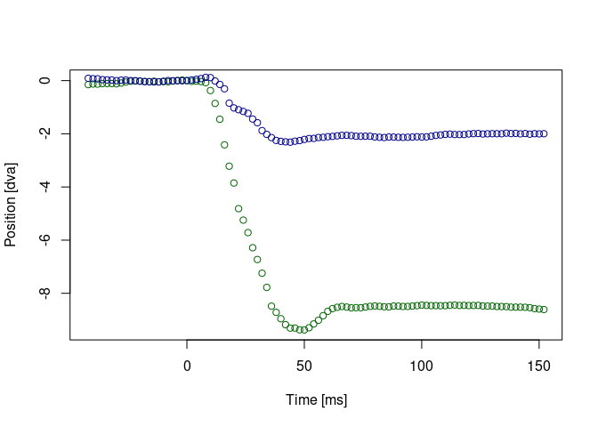
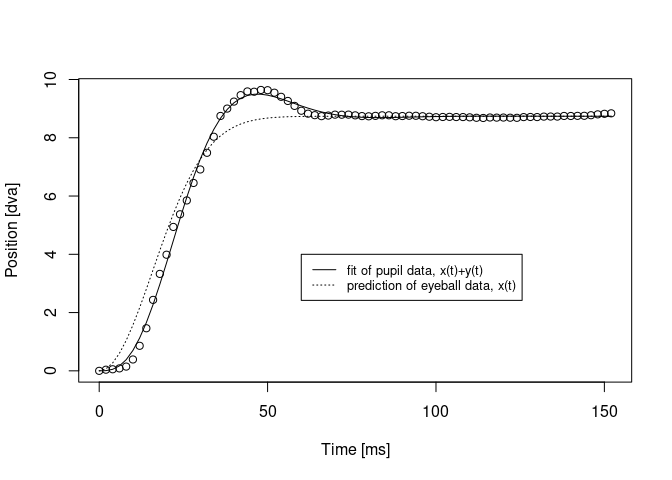
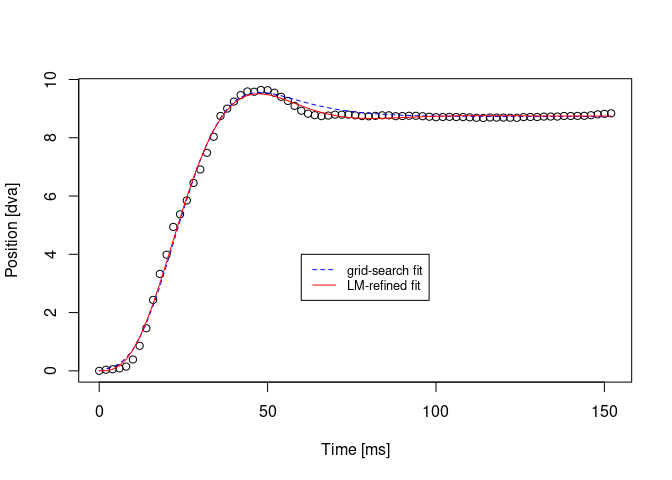

Modeling and Detection of PSOs
================
Richard Schweitzer
3/12/2021

This is the supplemental Code for the book chapter “Definition, modeling
and detection of saccades in the face of post-saccadic oscillations” by
Richard Schweitzer and Martin Rolfs.

## Using the Bouzat-Del Punta model to generate saccades with PSOs

Let’s first look at the function to generate saccades with post-saccadic
oscillations (PSOs). To do that, we need to source two functions first
and you should have the package *deSolve* installed.

``` r
library(deSolve)
source("hypergeom1F1.R") # hypergeometric function 1F1 from CharFun
source("PSO_fit.R") # all the relevant model formulas

# what's the time interval?
t_sac <- seq(0, 120)

# plot some random trajectories here:
plot(t_sac, PSO_fit(t_sac = t_sac, xm = 10, beta = 1, mu = 2, A = 0.04, 
                    gamma0 = 0.15, k0 = 0.032), col = "black", 
     xlab = "Time [ms]", ylab = "Position [dva]")
points(t_sac, PSO_fit(t_sac = t_sac, xm = 6, beta = 1, mu = 2, A = 0.04, 
                      gamma0 = 0.15, k0 = 0.032), col = "blue")
points(t_sac, PSO_fit(t_sac = t_sac, xm = 2, beta = 1, mu = 2, A = 0.04, 
                      gamma0 = 0.15, k0 = 0.032), col = "red")
lines(t_sac, x_t(t = t_sac, beta = 1, mu = 2, xm = 10, A = 0.04), col = "black")
lines(t_sac, x_t(t = t_sac, beta = 1, mu = 2, xm = 6, A = 0.04), col = "blue")
lines(t_sac, x_t(t = t_sac, beta = 1, mu = 2, xm = 2, A = 0.04), col = "red")
legend(100, 2, legend=c("xm=10", "xm=6", "xm=2"),
       col=c("black", "blue", "red"), lty=1, cex=0.8)
```

<!-- -->

``` r
# Replicate Fig. 3 in Bouzat et al. (2018), at least for xm=16
plot(t_sac, PSO_fit(t_sac = t_sac, xm = 16, beta = 1, mu = 2, A = 0.04, 
                    gamma0 = 0.15, k0 = 0.032, c = 0, d = 0), 
     col = "black", type = "l", ylim = c(0, 20), 
     xlab = "Time [ms]", ylab = "Position [dva]")
lines(t_sac, PSO_fit(t_sac = t_sac, xm = 16, beta = 1, mu = 2, A = 0.04, 
                     gamma0 = 0.15, k0 = 0.032, c = 0.5, d = 3), 
      col = "red", type = "l")
legend(60, 5, legend=c("constant (c=0, d=0)", "force-dependent (c=0.5, d=3)"),
       col=c("black", "red"), lty=1, cex=0.8)
```

<!-- -->

``` r
# Replicate Fig. 9 in Del Punta et al. (2019)
plot(t_sac, PSO_fit(t_sac = t_sac, xm = 10, beta = 1, mu = 2, A = 0.036, 
                    gamma0 = 0.14, k0 = 0.04, c = 0.5, d = 3, 
                    viscosity = FALSE), col = "blue", type = "l", ylim = c(0, 13.5), 
     xlab = "Time [ms]", ylab = "Position [dva]")
lines(t_sac, PSO_fit(t_sac = t_sac, xm = 10, beta = 1, mu = 2, A = 0.036, 
                     gamma0 = 0.07, k0 = 0.035, c = 1, d = 5, 
                     viscosity = TRUE), col = "red")
lines(t_sac, x_t(t = t_sac, beta = 1, mu = 2, xm = 10, A = 0.036), col = "black")
legend(60, 5, legend=c("x(t)", "x(t)+y(t) force-dependent (c=0.5, d=3)", "x(t)+y(t) viscosity (c=1, d=5)"),
       col=c("black", "blue", "red"), lty=1, cex=0.8)
```

<!-- -->

Okay, great, shall we look at an empirically measured saccade? Here we
load a random saccade, in fact, one that is from a manually coded
database by Nystrom and colleagues, found here:
<http://dev.humlab.lu.se/www-transfer/people/marcus-nystrom/annotated_data.zip>

``` r
load("some_sac.rda")
# what does this saccade look like?
plot(some_sac$time_sacon, some_sac$x_sacon, col = "darkgreen", 
     type = "p", xlab = "Time [ms]", ylab = "Position [dva]")
points(some_sac$time_sacon, some_sac$y_sacon, col = "darkblue")
```

<!-- -->

``` r
# alternatively, a trajectory that we can fit
plot(some_sac$time_sacon[some_sac$time_sacon>=0], 
     some_sac$dist_sacon[some_sac$time_sacon>=0], 
     col = "black", type = "p", xlab = "Time [ms]", ylab = "Position [dva]")
```

<!-- -->

Now try fitting Method 1. Run an optimizer with a grid of different
starting parameters.

``` r
library(minpack.lm) # for Levenberg-Marquart
library(data.table)
# this is the function for running the optimizer with a grid of starting parameters:
source("get_best_NLS.R")

# options for fitting?
nls_options <- nls.lm.control(maxiter = 100, nprint = 0)
# model formula as a string:
nls_model_form <- "dist_sacon ~ PSO_fit(time_sacon, xm, beta=1, mu=2, A, gamma0, k0, c=0, d=0)"
# run:
best_PSO_model <- get_best_NLS(df = some_sac[some_sac$time_sacon>=0, ], 
                               model_control = nls_options, 
                               model_form = nls_model_form,
                               start_params_low = c(xm = 7, A = 0.02, gamma0 = 0.05, k0 = 0.01),
                               start_params_high = c(xm = 12, A = 0.08, gamma0 = 0.2, k0 = 0.1),
                               absolute_lowest = c(xm = 10e-6, A = 10e-6, gamma0 = 10e-6, k0 = 10e-6),
                               start_params_n = 3, use_robust = FALSE, 
                               debug_mode = FALSE)
```

    ## Loading required package: assertthat

``` r
best_PSO_model
```

    ## $best_fit
    ## Nonlinear regression model
    ##   model: dist_sacon ~ PSO_fit(time_sacon, xm, beta = 1, mu = 2, A, gamma0,     k0, c = 0, d = 0)
    ##    data: df
    ##      xm       A  gamma0      k0 
    ## 8.73950 0.03456 0.15544 0.01434 
    ##  residual sum-of-squares: 1.424
    ## 
    ## Number of iterations to convergence: 12 
    ## Achieved convergence tolerance: 1.49e-08
    ## 
    ## $best_params
    ##          xm          A    gamma0         k0       BIC       AIC
    ## 1: 8.739504 0.03455742 0.1554378 0.01433718 -67.00563 -78.72466

``` r
# what does this look like?
plot(some_sac$time_sacon[some_sac$time_sacon>=0],  # data
     some_sac$dist_sacon[some_sac$time_sacon>=0], 
     col = "black", type = "p", xlab = "Time [ms]", ylab = "Position [dva]")
lines(some_sac$time_sacon[some_sac$time_sacon>=0], # fit
     predict(best_PSO_model$best_fit), 
     col = "black")
lines(some_sac$time_sacon[some_sac$time_sacon>=0], # eyeball prediction
      x_t(t = some_sac$time_sacon[some_sac$time_sacon>=0], 
          xm = best_PSO_model$best_params$xm, A = best_PSO_model$best_params$A, beta = 1, mu = 2), 
      col = "black", lty = "dotted")
legend(60, 4, legend=c("fit of pupil data, x(t)+y(t)", "prediction of eyeball data, x(t)"),
       col=c("black", "black"), lty=c("solid", "dotted"), cex=0.8)
```

<!-- -->

Fitting method 2. Run a grid-search

``` r
library(nls2) # for grid search
```

    ## Loading required package: proto

``` r
# what's most likely the amplitude of the saccade? Just to have a reasonable start for xm
likely_amp <- some_sac$dist_sacon[some_sac$time_sacoff==0]

## step 1: brute-force starting parameters, here we even add mu
# define the grid for the search. it's rather coarse here, but it can always be expanded
brute_st1 <- expand.grid(xm = seq(likely_amp-0.2, likely_amp+0.2, len = 4), 
                         mu = seq(1.5, 3, len = 4), A = seq(0.02, 0.06, len = 4),
                         gamma0 = seq(0.1, 0.2, len = 4), k0 = seq(0.01, 0.04, len = 4) )
head(brute_st1)
```

    ##         xm  mu    A gamma0   k0
    ## 1 8.594055 1.5 0.02    0.1 0.01
    ## 2 8.727388 1.5 0.02    0.1 0.01
    ## 3 8.860721 1.5 0.02    0.1 0.01
    ## 4 8.994055 1.5 0.02    0.1 0.01
    ## 5 8.594055 2.0 0.02    0.1 0.01
    ## 6 8.727388 2.0 0.02    0.1 0.01

``` r
# run the grid-search here
brute_fit <- nls2(data = some_sac[some_sac$time_sacon>=0, ],
                  formula = dist_sacon ~ PSO_fit(time_sacon, xm, beta=1,
                                                 mu, A, gamma0, k0, c=0, d=0,
                                                 viscosity = FALSE,
                                                 use_method = "euler"), # Euler should be fastest method
                  start = brute_st1, algorithm = "brute-force")
brute_fit
```

    ## Nonlinear regression model
    ##   model: dist_sacon ~ PSO_fit(time_sacon, xm, beta = 1, mu, A, gamma0,     k0, c = 0, d = 0, viscosity = FALSE, use_method = "euler")
    ##    data: some_sac[some_sac$time_sacon >= 0, ]
    ##      xm      mu       A  gamma0      k0 
    ## 8.72739 2.50000 0.03333 0.20000 0.01000 
    ##  residual sum-of-squares: 2.161
    ## 
    ## Number of iterations to convergence: 1024 
    ## Achieved convergence tolerance: NA

``` r
brute_fit_coef <- as.numeric(coefficients(brute_fit))

# step 2: refine fit with Levenberg Marquart
refined_fit <- nlsLM(data = some_sac[some_sac$time_sacon>=0, ], 
                     control = nls.lm.control(maxiter = 500, nprint = 1),
                     formula = dist_sacon ~ PSO_fit(time_sacon, xm, beta=1, 
                                                    mu, A, gamma0, k0, c=0, d=0,
                                                    viscosity = FALSE),
                     start = c(xm = brute_fit_coef[1], mu = brute_fit_coef[2], A = brute_fit_coef[3], 
                               gamma0 = brute_fit_coef[4], k0 = brute_fit_coef[5]),
                     lower = c(xm = 10e-6, mu=1, A = 10e-6, 
                               gamma0 = 10e-6, k0 = 10e-6))
```

    ## It.    0, RSS =    2.29112, Par. =    8.72739        2.5  0.0333333        0.2       0.01
    ## It.    1, RSS =    1.84707, Par. =    8.70515    2.42664  0.0327315   0.191601  0.0105972
    ## It.    2, RSS =    1.56912, Par. =    8.71696    2.27858  0.0321721   0.183693  0.0129279
    ## It.    3, RSS =    1.51418, Par. =    8.74698    1.92533  0.0344045    0.15505  0.0151076
    ## It.    4, RSS =    1.42495, Par. =    8.74468     1.7599  0.0380776   0.137146  0.0137923
    ## It.    5, RSS =     1.4061, Par. =    8.74805    1.61059  0.0417131   0.128042  0.0134946
    ## It.    6, RSS =    1.38643, Par. =    8.74748    1.64891  0.0411929   0.130726  0.0136015
    ## It.    7, RSS =    1.38638, Par. =    8.74824    1.61435  0.0421277    0.12827  0.0134758
    ## It.    8, RSS =    1.38627, Par. =    8.74778    1.63746  0.0415116   0.129893  0.0135578
    ## It.    9, RSS =    1.38625, Par. =     8.7481     1.6222  0.0419354   0.128826  0.0135025
    ## It.   10, RSS =    1.38624, Par. =     8.7479    1.63206  0.0416693   0.129517  0.0135377
    ## It.   11, RSS =    1.38623, Par. =    8.74803    1.62559  0.0418474   0.129065  0.0135144
    ## It.   12, RSS =    1.38623, Par. =    8.74794    1.62978  0.0417334   0.129358  0.0135294
    ## It.   13, RSS =    1.38623, Par. =      8.748    1.62705  0.0418084   0.129167  0.0135196
    ## It.   14, RSS =    1.38623, Par. =    8.74796    1.62883  0.0417599   0.129291  0.0135259
    ## It.   15, RSS =    1.38623, Par. =    8.74799    1.62767  0.0417916    0.12921  0.0135218
    ## It.   16, RSS =    1.38623, Par. =    8.74797    1.62842   0.041771   0.129263  0.0135245
    ## It.   17, RSS =    1.38623, Par. =    8.74798    1.62793  0.0417844   0.129229  0.0135227
    ## It.   18, RSS =    1.38623, Par. =    8.74798    1.62825  0.0417757   0.129251  0.0135239
    ## It.   19, RSS =    1.38623, Par. =    8.74798    1.62805  0.0417813   0.129237  0.0135231

``` r
refined_fit
```

    ## Nonlinear regression model
    ##   model: dist_sacon ~ PSO_fit(time_sacon, xm, beta = 1, mu, A, gamma0,     k0, c = 0, d = 0, viscosity = FALSE)
    ##    data: some_sac[some_sac$time_sacon >= 0, ]
    ##      xm      mu       A  gamma0      k0 
    ## 8.74798 1.62805 0.04178 0.12924 0.01352 
    ##  residual sum-of-squares: 1.386
    ## 
    ## Number of iterations to convergence: 19 
    ## Achieved convergence tolerance: 1.49e-08

``` r
# fitting method 1 vs 2, that is without vs with mu
anova(best_PSO_model$best_fit, # Fitting method 1, fixed mu 
      refined_fit) # Fitting method 2, refined fit, free mu
```

    ## Analysis of Variance Table
    ## 
    ## Model 1: dist_sacon ~ PSO_fit(time_sacon, xm, beta = 1, mu = 2, A, gamma0, k0, c = 0, d = 0)
    ## Model 2: dist_sacon ~ PSO_fit(time_sacon, xm, beta = 1, mu, A, gamma0, k0, c = 0, d = 0, viscosity = FALSE)
    ##   Res.Df Res.Sum Sq Df   Sum Sq F value Pr(>F)
    ## 1     73     1.4243                           
    ## 2     72     1.3862  1 0.038039  1.9757 0.1641

``` r
## plot the predictions of the brute and refined fits
plot(some_sac$time_sacon[some_sac$time_sacon>=0],  # data
     some_sac$dist_sacon[some_sac$time_sacon>=0], 
     col = "black", type = "p", xlab = "Time [ms]", ylab = "Position [dva]")
lines(some_sac$time_sacon[some_sac$time_sacon>=0], # brute fit
     predict(brute_fit), 
     col = "blue", lty = "dashed")
lines(some_sac$time_sacon[some_sac$time_sacon>=0], # refined fit
      predict(refined_fit), 
      col = "red", lty = "solid")
legend(60, 4, legend=c("grid-search fit", "LM-refined fit"),
       col=c("blue", "red"), lty=c("dashed", "solid"), cex=0.8)
```

<!-- -->
