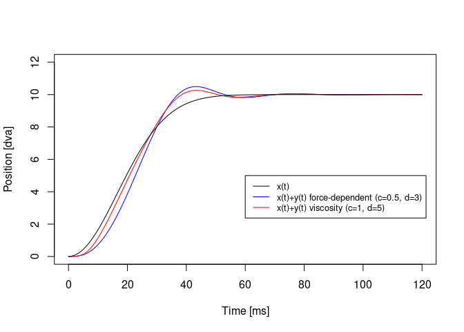
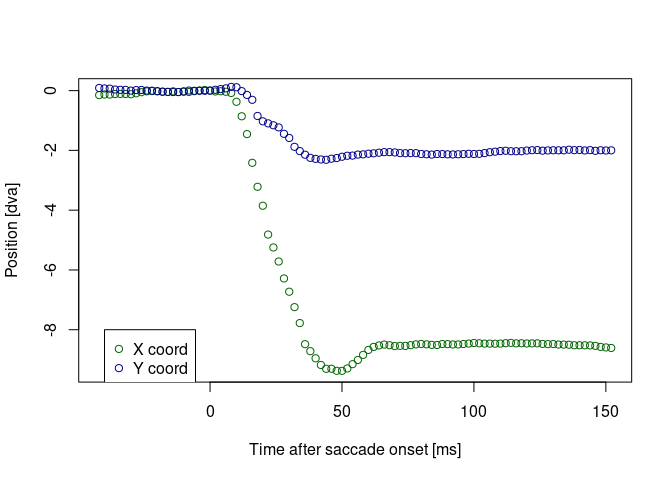
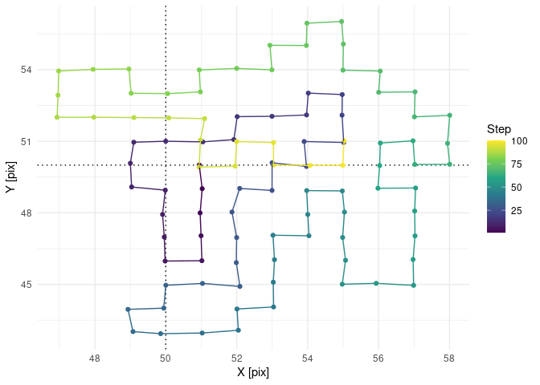
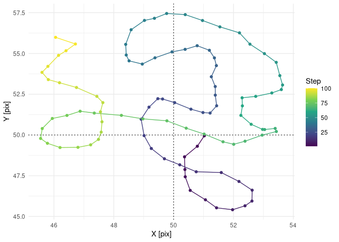
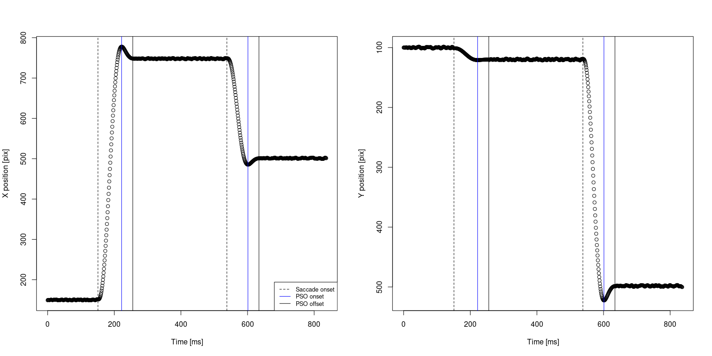
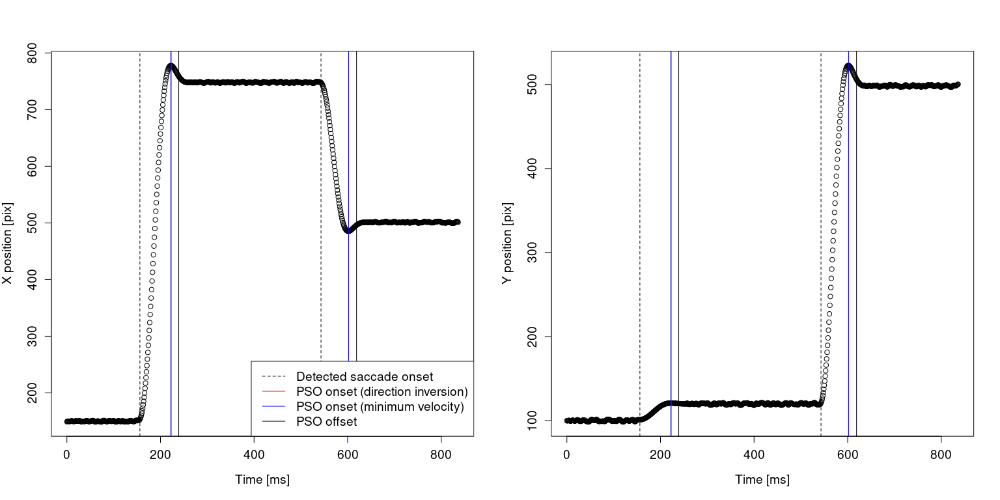
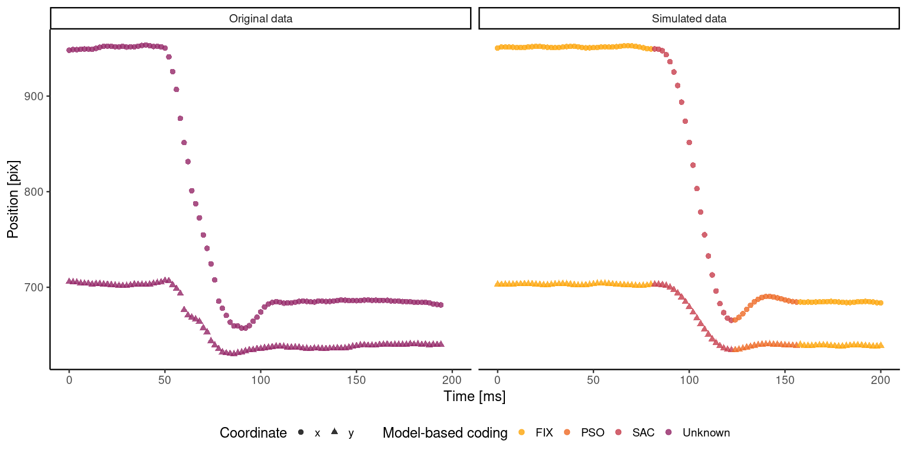
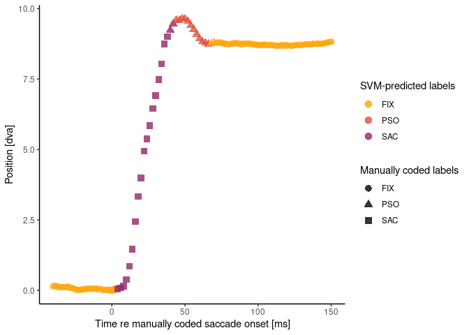

Modeling and Detection of PSOs
================
Richard Schweitzer
3/12/2021

This is the supplemental Code for the book chapter “Definition, modeling
and detection of saccades in the face of post-saccadic oscillations” by
Richard Schweitzer and Martin Rolfs.

## Using the Bouzat-Del Punta model to generate saccades with PSOs

Let’s first look at the function to generate saccades with post-saccadic
oscillations (PSOs). To do that, we need to source two functions first
and you should have the package *deSolve* installed.

``` r
library(deSolve)
source("hypergeom1F1.R") # hypergeometric function 1F1 from CharFun
source("PSO_fit.R") # all the relevant model formulas

# what's the time interval?
t_sac <- seq(0, 120)

# plot some random trajectories here:
plot(t_sac, PSO_fit(t_sac = t_sac, xm = 10, beta = 1, mu = 2, A = 0.04, 
                    gamma0 = 0.15, k0 = 0.032), col = "black", 
     xlab = "Time [ms]", ylab = "Position [dva]")
points(t_sac, PSO_fit(t_sac = t_sac, xm = 6, beta = 1, mu = 2, A = 0.04, 
                      gamma0 = 0.15, k0 = 0.032), col = "blue")
points(t_sac, PSO_fit(t_sac = t_sac, xm = 2, beta = 1, mu = 2, A = 0.04, 
                      gamma0 = 0.15, k0 = 0.032), col = "red")
lines(t_sac, x_t(t = t_sac, beta = 1, mu = 2, xm = 10, A = 0.04), col = "black")
lines(t_sac, x_t(t = t_sac, beta = 1, mu = 2, xm = 6, A = 0.04), col = "blue")
lines(t_sac, x_t(t = t_sac, beta = 1, mu = 2, xm = 2, A = 0.04), col = "red")
legend(100, 2, legend=c("xm=10", "xm=6", "xm=2"),
       col=c("black", "blue", "red"), lty=1, cex=0.8)
```

<!-- -->

``` r
# Replicate Fig. 3 in Bouzat et al. (2018), at least for xm=16
plot(t_sac, PSO_fit(t_sac = t_sac, xm = 16, beta = 1, mu = 2, A = 0.04, 
                    gamma0 = 0.15, k0 = 0.032, c = 0, d = 0), 
     col = "black", type = "l", ylim = c(0, 17), 
     xlab = "Time [ms]", ylab = "Position [dva]")
lines(t_sac, PSO_fit(t_sac = t_sac, xm = 16, beta = 1, mu = 2, A = 0.04, 
                     gamma0 = 0.15, k0 = 0.032, c = 0.5, d = 3), 
      col = "red", type = "l")
legend(60, 5, legend=c("constant (c=0, d=0)", "force-dependent (c=0.5, d=3)"),
       col=c("black", "red"), lty=1, cex=0.8)
```

<!-- -->

``` r
# Replicate Fig. 9 in Del Punta et al. (2019)
plot(t_sac, PSO_fit(t_sac = t_sac, xm = 10, beta = 1, mu = 2, A = 0.036, 
                    gamma0 = 0.14, k0 = 0.04, c = 0.5, d = 3, 
                    viscosity = FALSE), col = "blue", type = "l", ylim = c(0, 12), 
     xlab = "Time [ms]", ylab = "Position [dva]")
lines(t_sac, PSO_fit(t_sac = t_sac, xm = 10, beta = 1, mu = 2, A = 0.036, 
                     gamma0 = 0.07, k0 = 0.035, c = 1, d = 5, 
                     viscosity = TRUE), col = "red")
lines(t_sac, x_t(t = t_sac, beta = 1, mu = 2, xm = 10, A = 0.036), col = "black")
legend(60, 5, legend=c("x(t)", "x(t)+y(t) force-dependent (c=0.5, d=3)", "x(t)+y(t) viscosity (c=1, d=5)"),
       col=c("black", "blue", "red"), lty=1, cex=0.8)
```

<!-- -->

Okay, great, shall we look at an empirically measured saccade? Here we
load a random saccade, in fact, one that is from a manually coded
database by Nystrom and colleagues, found here:
<http://dev.humlab.lu.se/www-transfer/people/marcus-nystrom/annotated_data.zip>

``` r
load("some_sac.rda")
# what does this saccade look like?
plot(some_sac$time_sacon, some_sac$x_sacon, col = "darkgreen", 
     type = "p", xlab = "Time after saccade onset [ms]", ylab = "Position [dva]")
points(some_sac$time_sacon, some_sac$y_sacon, col = "darkblue")
legend(-40, -8, legend=c("X coord", "Y coord"),
       col=c("darkgreen", "darkblue"), pch = c(1, 1))
```

<!-- -->

``` r
# alternatively, a trajectory that we can fit
plot(some_sac$time_sacon[some_sac$time_sacon>=0], 
     some_sac$dist_sacon[some_sac$time_sacon>=0], 
     col = "black", type = "p", xlab = "Time after saccade onset [ms]", ylab = "Position [dva]")
```

<!-- -->

Now try fitting Method 1. Run an optimizer with a grid of different
starting parameters.

``` r
library(minpack.lm) # for Levenberg-Marquart
library(data.table)
library(assertthat)

# this is the function for running the optimizer with a grid of starting parameters:
source("get_best_NLS.R")

# options for fitting?
nls_options <- nls.lm.control(maxiter = 100, nprint = 0)
# model formula as a string:
nls_model_form <- "dist_sacon ~ PSO_fit(time_sacon, xm, beta=1, mu=2, A, gamma0, k0, c=0, d=0)"
# run:
best_PSO_model <- get_best_NLS(df = some_sac[some_sac$time_sacon>=0, ], 
                               model_control = nls_options, 
                               model_form = nls_model_form,
                               start_params_low = c(xm = 7, A = 0.02, gamma0 = 0.05, k0 = 0.01),
                               start_params_high = c(xm = 12, A = 0.08, gamma0 = 0.2, k0 = 0.1),
                               absolute_lowest = c(xm = 10e-6, A = 10e-6, gamma0 = 10e-6, k0 = 10e-6),
                               start_params_n = 3, use_robust = FALSE, 
                               debug_mode = FALSE)
nrow(best_PSO_model$start_params) # number of all combinations of starting parameters
```

    ## [1] 81

``` r
best_PSO_model$best_fit # the best model
```

    ## Nonlinear regression model
    ##   model: dist_sacon ~ PSO_fit(time_sacon, xm, beta = 1, mu = 2, A, gamma0,     k0, c = 0, d = 0)
    ##    data: df
    ##      xm       A  gamma0      k0 
    ## 8.73950 0.03456 0.15544 0.01434 
    ##  residual sum-of-squares: 1.424
    ## 
    ## Number of iterations to convergence: 12 
    ## Achieved convergence tolerance: 1.49e-08

``` r
# what does this look like?
plot(some_sac$time_sacon[some_sac$time_sacon>=0],  # data
     some_sac$dist_sacon[some_sac$time_sacon>=0], 
     col = "black", type = "p", xlab = "Time [ms]", ylab = "Position [dva]")
lines(some_sac$time_sacon[some_sac$time_sacon>=0], # fit
     predict(best_PSO_model$best_fit), 
     col = "black")
lines(some_sac$time_sacon[some_sac$time_sacon>=0], # eyeball prediction
      x_t(t = some_sac$time_sacon[some_sac$time_sacon>=0], 
          xm = best_PSO_model$best_params$xm, A = best_PSO_model$best_params$A, beta = 1, mu = 2), 
      col = "black", lty = "dotted")
legend(60, 4, legend=c("fit of pupil data, x(t)+y(t)", "prediction of eyeball data, x(t)"),
       col=c("black", "black"), lty=c("solid", "dotted"), cex=0.8)
```

<!-- -->

Fitting method 2. First run a (coarse) grid-search, find the best
fitting parameters and then use those as starting parameters in a
refinement step fit

``` r
library(nls2) # for grid search
```

    ## Loading required package: proto

``` r
# what's most likely the amplitude of the saccade? Just to have a reasonable start for xm
likely_amp <- some_sac$dist_sacon[some_sac$time_sacoff==0]

# step 1: brute-force starting parameters
# define the grid for the search. it's rather coarse here, but it can always be expanded
brute_st1 <- expand.grid(xm = seq(likely_amp-0.2, likely_amp+0.2, len = 4), 
                         mu = seq(1.5, 3, len = 4), A = seq(0.02, 0.06, len = 4),
                         gamma0 = seq(0.1, 0.2, len = 4), k0 = seq(0.01, 0.04, len = 4) )
head(brute_st1)
```

    ##         xm  mu    A gamma0   k0
    ## 1 8.594055 1.5 0.02    0.1 0.01
    ## 2 8.727388 1.5 0.02    0.1 0.01
    ## 3 8.860721 1.5 0.02    0.1 0.01
    ## 4 8.994055 1.5 0.02    0.1 0.01
    ## 5 8.594055 2.0 0.02    0.1 0.01
    ## 6 8.727388 2.0 0.02    0.1 0.01

``` r
# run the grid-search here
brute_fit <- nls2(data = some_sac[some_sac$time_sacon>=0, ],
                  formula = dist_sacon ~ PSO_fit(time_sacon, xm, beta=1,
                                                 mu, A, gamma0, k0, c=0, d=0,
                                                 viscosity = FALSE,
                                                 use_method = "euler"), # Euler should be fastest method
                  start = brute_st1, algorithm = "brute-force")
brute_fit
```

    ## Nonlinear regression model
    ##   model: dist_sacon ~ PSO_fit(time_sacon, xm, beta = 1, mu, A, gamma0,     k0, c = 0, d = 0, viscosity = FALSE, use_method = "euler")
    ##    data: some_sac[some_sac$time_sacon >= 0, ]
    ##      xm      mu       A  gamma0      k0 
    ## 8.72739 2.50000 0.03333 0.20000 0.01000 
    ##  residual sum-of-squares: 2.161
    ## 
    ## Number of iterations to convergence: 1024 
    ## Achieved convergence tolerance: NA

``` r
brute_fit_coef <- as.numeric(coefficients(brute_fit))

# step 2: refine fit with Levenberg Marquart
refined_fit <- nlsLM(data = some_sac[some_sac$time_sacon>=0, ], 
                     control = nls.lm.control(maxiter = 500, nprint = 1),
                     formula = dist_sacon ~ PSO_fit(time_sacon, xm, beta=1, 
                                                    mu, A, gamma0, k0, c=0, d=0,
                                                    viscosity = FALSE),
                     start = c(xm = brute_fit_coef[1], mu = brute_fit_coef[2], A = brute_fit_coef[3], 
                               gamma0 = brute_fit_coef[4], k0 = brute_fit_coef[5]),
                     lower = c(xm = 10e-6, mu=1, A = 10e-6, 
                               gamma0 = 10e-6, k0 = 10e-6))
```

    ## It.    0, RSS =    2.29112, Par. =    8.72739        2.5  0.0333333        0.2       0.01
    ## It.    1, RSS =    1.84707, Par. =    8.70515    2.42664  0.0327315   0.191601  0.0105972
    ## It.    2, RSS =    1.56912, Par. =    8.71696    2.27858  0.0321721   0.183693  0.0129279
    ## It.    3, RSS =    1.51418, Par. =    8.74698    1.92533  0.0344045    0.15505  0.0151076
    ## It.    4, RSS =    1.42495, Par. =    8.74468     1.7599  0.0380776   0.137146  0.0137923
    ## It.    5, RSS =     1.4061, Par. =    8.74805    1.61059  0.0417131   0.128042  0.0134946
    ## It.    6, RSS =    1.38643, Par. =    8.74748    1.64891  0.0411929   0.130726  0.0136015
    ## It.    7, RSS =    1.38638, Par. =    8.74824    1.61435  0.0421277    0.12827  0.0134758
    ## It.    8, RSS =    1.38627, Par. =    8.74778    1.63746  0.0415116   0.129893  0.0135578
    ## It.    9, RSS =    1.38625, Par. =     8.7481     1.6222  0.0419354   0.128826  0.0135025
    ## It.   10, RSS =    1.38624, Par. =     8.7479    1.63206  0.0416693   0.129517  0.0135377
    ## It.   11, RSS =    1.38623, Par. =    8.74803    1.62559  0.0418474   0.129065  0.0135144
    ## It.   12, RSS =    1.38623, Par. =    8.74794    1.62978  0.0417334   0.129358  0.0135294
    ## It.   13, RSS =    1.38623, Par. =      8.748    1.62705  0.0418084   0.129167  0.0135196
    ## It.   14, RSS =    1.38623, Par. =    8.74796    1.62883  0.0417599   0.129291  0.0135259
    ## It.   15, RSS =    1.38623, Par. =    8.74799    1.62767  0.0417916    0.12921  0.0135218
    ## It.   16, RSS =    1.38623, Par. =    8.74797    1.62842   0.041771   0.129263  0.0135245
    ## It.   17, RSS =    1.38623, Par. =    8.74798    1.62793  0.0417844   0.129229  0.0135227
    ## It.   18, RSS =    1.38623, Par. =    8.74798    1.62825  0.0417757   0.129251  0.0135239
    ## It.   19, RSS =    1.38623, Par. =    8.74798    1.62805  0.0417813   0.129237  0.0135231

``` r
refined_fit
```

    ## Nonlinear regression model
    ##   model: dist_sacon ~ PSO_fit(time_sacon, xm, beta = 1, mu, A, gamma0,     k0, c = 0, d = 0, viscosity = FALSE)
    ##    data: some_sac[some_sac$time_sacon >= 0, ]
    ##      xm      mu       A  gamma0      k0 
    ## 8.74798 1.62805 0.04178 0.12924 0.01352 
    ##  residual sum-of-squares: 1.386
    ## 
    ## Number of iterations to convergence: 19 
    ## Achieved convergence tolerance: 1.49e-08

``` r
# fitting method 1 vs 2, that is without vs with mu
anova(best_PSO_model$best_fit, # Fitting method 1, fixed mu 
      refined_fit) # Fitting method 2, refined fit, free mu
```

    ## Analysis of Variance Table
    ## 
    ## Model 1: dist_sacon ~ PSO_fit(time_sacon, xm, beta = 1, mu = 2, A, gamma0, k0, c = 0, d = 0)
    ## Model 2: dist_sacon ~ PSO_fit(time_sacon, xm, beta = 1, mu, A, gamma0, k0, c = 0, d = 0, viscosity = FALSE)
    ##   Res.Df Res.Sum Sq Df   Sum Sq F value Pr(>F)
    ## 1     73     1.4243                           
    ## 2     72     1.3862  1 0.038039  1.9757 0.1641

``` r
## plot the predictions of the brute and refined fits
plot(some_sac$time_sacon[some_sac$time_sacon>=0],  # data
     some_sac$dist_sacon[some_sac$time_sacon>=0], 
     col = "black", type = "p", xlab = "Time [ms]", ylab = "Position [dva]")
lines(some_sac$time_sacon[some_sac$time_sacon>=0], # brute fit
     predict(brute_fit), 
     col = "blue", lty = "dashed")
lines(some_sac$time_sacon[some_sac$time_sacon>=0], # refined fit
      predict(refined_fit), 
      col = "red", lty = "solid")
legend(60, 4, legend=c("grid-search fit", "LM-refined fit"),
       col=c("blue", "red"), lty=c("dashed", "solid"), cex=0.8)
```

<!-- -->

## The saccade simulator

Using the model function above, we can simulate saccades with
post-saccadic oscillations. But what about fixations? Can we simulate
fixational drift? Yes, there is a model by Engbert and colleagues, see
<https://doi.org/10.1073/pnas.1102730108>. It’s implemented in the
*self\_avoiding\_walk* function.

``` r
library(ggplot2)
library(viridis)
```

    ## Loading required package: viridisLite

``` r
source("self_avoiding_walk.R")
# discrete
walked_discrete <- self_avoiding_walk(n_steps = 100, 
                                      relax_rate = 0.01,
                                      L = 101, U_slope = 0.2, 
                                      U_m_sd=c(0.5, 0.2), 
                                      use_only_direct_neighbors = TRUE, 
                                      do_plot = TRUE, 
                                      do_final_smooth = FALSE)
```

<!-- -->

``` r
# smooth version
walked_smooth <- self_avoiding_walk(n_steps = 100,  
                                    relax_rate = 0.01, 
                                    L = 101, U_slope = 0.2, 
                                    U_m_sd=c(0.5, 0.2), 
                                    use_only_direct_neighbors = TRUE, 
                                    do_plot = TRUE, 
                                    do_final_smooth = TRUE)
```

<!-- -->

Now, there’s a easy-to-use package, the saccade simulator. Here we
simulate a sequence of two saccades.

``` r
source("saccade_simulator.R") # includes main function and aux functions

# Fixation characteristics
# fixation X, Y [pix], and duration [ms]
fixpos_xy <- matrix(data = c(150, 100, 150, 
                             750, 120, 280, 
                             500, 500, 200), 
                    nrow = 3, ncol = 3, byrow = TRUE)
# Saccade model parameters:
# beta, mu, A, gamma, k, c, d, viscosity; while xm is determined by fixation positions
sac_params <- matrix(data = c(1, 2.2, 0.04, 0.14, 0.013, 0.5, 3, FALSE, 
                              1, 2.2, 0.04, 0.14, 0.013, 0.5, 3, FALSE), 
                     nrow = 2, ncol = 8, byrow = TRUE)
# Fixation model parameters:
# relax_rate, U_slope, U_mean, U_sd, direct neighbors only
fix_params <- matrix(data = rep(c(0.01, 10, 0, 0, FALSE), 
                                3), 
                     nrow = 3, ncol = 5, byrow = TRUE)  
# Now run the saccade simulator:
simulator_results <- saccade_simulator(fixpos_xy = fixpos_xy, 
                                       sac_params = sac_params, 
                                       fix_params = fix_params, 
                                       pix_per_dva = 25, # pixels per degree, should be matched to setup
                                       detect_vel_criterion = 5, # ground-truth velocity criterion [dva/s]
                                       sampling_rate = 1000, # in Hz
                                       noise_to_saccades_sd = 0, # should Gaussian noise be added to saccades?
                                       smooth_to_fixation = TRUE, # FALSE: discrete, TRUE: smooth fixation data
                                       do_plot = TRUE) 
```

<!-- -->

``` r
head(simulator_results[[1]]) # raw position data
```

    ##           x     y time what
    ## 1: 150.0000  99.0    0  FIX
    ## 2: 150.3333 100.0    1  FIX
    ## 3: 150.0000 100.0    2  FIX
    ## 4: 150.2000 100.0    3  FIX
    ## 5: 150.0000  99.8    4  FIX
    ## 6: 149.8000  99.4    5  FIX

``` r
head(simulator_results[[2]]) # fixation and saccade metrics
```

    ##    t_fixon  x_fixon  y_fixon t_fixoff t_sacon  x_sacon  y_sacon t_sacoff
    ## 1:       0 150.0000 100.0000      150     151 150.0000  99.0000    255.7
    ## 2:     257 748.0344 119.9312      537     538 749.0344 121.9312    634.1
    ## 3:     636 501.1396 498.2699      836     NaN      NaN      NaN      NaN
    ##    t_sacoff_PSO x_sacoff y_sacoff sac_vpeak sac_vmean
    ## 1:        222.1 748.0344 119.9312  620.9659  256.9775
    ## 2:        601.0 501.1396 498.2699  537.8644  217.0725
    ## 3:          NaN      NaN      NaN       NaN       NaN

## Velocity-based saccade and PSO detection

We describe an add-on the widely used Engbert-Kliegl algorithm for
microsaccade detection (see
<http://read.psych.uni-potsdam.de/index.php?option=com_content&view=article&id=140:engbert-et-al-2015-microsaccade-toolbox-for-r&catid=26:publications&Itemid=34>
for the original algorithm), which detects PSOs based on minimum
velocity or direction inversion. We’ll use that here on our just
simulated data.

``` r
# STEP 1: Detect saccades with EK algorithm and we'll see how PSOs are detected as saccades
source("vecvel.R") # from MS toolbox. Transforms into 2D velocity space
source("microsacc.R") # from MS toolbox. Original algorithm
# Output:
#  [,1]   saccade onset [index]
#  [,2]   saccade offset [index]
#  [,3]   peak velocity (vpeak)
#  [,4]   horizontal component (dx, i.e., x[off]-x[on])
#  [,5]   vertical component (dy)
#  [,6]   horizontal amplitude (dX, i.e., x[max(x)]-x[min(x)])
#  [,7]   vertical amplitude (dY)
(original_EK_results <- microsacc(x = as.matrix(cbind(simulator_results[[1]]$x, simulator_results[[1]]$y)), 
                                  VFAC = 4, MINDUR = 5, SAMPLING = 1000))
```

    ## $table
    ##      [,1] [,2]      [,3]       [,4]        [,5]       [,6]        [,7]
    ## [1,]  157  219 15500.805  621.95709  21.7684982  621.95709  21.7684982
    ## [2,]  230  240  1459.128  -13.99162  -0.4897066  -13.99162  -0.4897066
    ## [3,]  544  599 13423.249 -261.42839 396.8846360 -261.42839 396.8846360
    ## [4,]  608  620  1442.366    8.91810 -13.5389153    8.91810 -13.5389153
    ## 
    ## $radius
    ## [1] 1236.085 1066.667

``` r
# STEP 2: 1st Add-on. Detect clusters of saccades. 
# Note that this currently only implemented for the (most common) case of clusters of two saccades
# Here we'll merge the 2nd saccade with the 1st saccade to run PSO detection later.
source("check_for_sac_clustering.R")
(clustered_EK_results <- check_for_sac_clustering(sac_table = original_EK_results$table, 
                                                  n_cluster_samples = 20, # number of samples distance
                                                  do_what = 2)) # 0: do nothing, 1: eliminate 2nd sac, 2: merge
```

    ##      [,1] [,2]     [,3]      [,4]      [,5]      [,6]      [,7]
    ## [1,]  157  240 15500.80  607.9655  21.27879  607.9655  21.27879
    ## [2,]  544  620 13423.25 -252.5103 383.34572 -252.5103 383.34572

``` r
# STEP 3: 2nd Add-on. Run PSO detection the clustered saccade data. 
# The algorithm adds 4 columns to the saccade table
# [,8] direction-inversion sample index
# [,9] overall saccade direction in degrees
# [,10] minimum-velocity sample index
# [,11] minimum velocity detected
source("check_for_PSO.R")
(PSO_EK_results <- check_for_PSO(eye_x = simulator_results[[1]]$x, 
                                 eye_y = simulator_results[[1]]$y, 
                                 samp_rate = 1000, 
                                 em_table = clustered_EK_results, 
                                 direction_range = 60))
```

    ##      [,1] [,2]     [,3]      [,4]      [,5]      [,6]      [,7] [,8]       [,9]
    ## [1,]  157  240 15500.80  607.9655  21.27879  607.9655  21.27879  224   2.004534
    ## [2,]  544  620 13423.25 -252.5103 383.34572 -252.5103 383.34572  603 123.372945
    ##      [,10]    [,11]
    ## [1,]   223 131.9229
    ## [2,]   602 121.9097

``` r
# PLOT the detection results:
par(mfrow=c(1,2)) 
# x 
plot(simulator_results[[1]]$time, simulator_results[[1]]$x, 
     xlab = "Time [ms]", ylab = "X position [pix]", 
     cex.lab = 1.2, cex.axis = 1.2)
abline(v = simulator_results[[1]]$time[PSO_EK_results[,1]], col = "black", lty = 2)
abline(v = simulator_results[[1]]$time[PSO_EK_results[,8]], col = "red")
abline(v = simulator_results[[1]]$time[PSO_EK_results[,10]], col = "blue")
abline(v = simulator_results[[1]]$time[PSO_EK_results[,2]], col = "black")
# legend
legend("bottomright", 
       legend=c("Detected saccade onset", "PSO onset (direction inversion)", 
                "PSO onset (minimum velocity)", 
                "PSO offset"),
       col=c("black", "red", "blue", "black"), 
       lty=c("dashed", "solid", "solid", "solid"), cex=1.2)
# y
plot(simulator_results[[1]]$time, simulator_results[[1]]$y, 
     xlab = "Time [ms]", ylab = "Y position [pix]", 
     cex.lab = 1.2, cex.axis = 1.2)
abline(v = simulator_results[[1]]$time[PSO_EK_results[,1]], col = "black", lty = 2)
abline(v = simulator_results[[1]]$time[PSO_EK_results[,8]], col = "red")
abline(v = simulator_results[[1]]$time[PSO_EK_results[,10]], col = "blue")
abline(v = simulator_results[[1]]$time[PSO_EK_results[,2]], col = "black")
```

<!-- -->

``` r
par(mfrow=c(1,1)) 

# DETECTION vs GROUND TRUTH
# PSO onset, probably virtually no mismatch
simulator_results[[2]]$t_sacoff_PSO[1:2] # ground truth PSO onset
```

    ## [1] 222.1 601.0

``` r
simulator_results[[1]]$time[PSO_EK_results[,8]] # PSO onset detected by direction-inversion
```

    ## [1] 223 602

``` r
simulator_results[[1]]$time[PSO_EK_results[,10]] # PSO onset detected by minimum velocity
```

    ## [1] 222 601

``` r
# PSO offset, probably large mismatch, given the difference in velocity thresholds
simulator_results[[2]]$t_sacoff[1:2] # ground truth PSO offset
```

    ## [1] 255.7 634.1

``` r
simulator_results[[1]]$time[PSO_EK_results[,2]] # PSO offset detected by the EK algorithm
```

    ## [1] 239 619

## PSO detection using linear classifiers trained on simulation data

As a first step, we take some empirically measured saccade with unknown
coding and use our saccade simulator to produce an artificial saccade
that looks similar.

``` r
# The Nystrom saccade was collected with these settings here:
samp_freq <- 500
monitor.dist <- 67
monitor.width <- 38
monitor.resx <- 1024
monitor.resy <- 768
screen_center <- data.frame(x = monitor.resx/2, y = monitor.resy/2)
(screen_ppd <- monitor.dist*tan(1*pi/180)/(monitor.width/monitor.resx))
```

    ## [1] 31.51466

``` r
# determine the fixation data from the hand-labeled saccade from above
fixpos_xy_Nystrom <-  matrix(data = c(median(some_sac[time_sacon<0, x]), 
                                      median(some_sac[time_sacon<0, y]), 
                                      sum(diff(some_sac[time_sacoff>0, time])), 
                                      median(some_sac[time_sacoff>0, x]), 
                                      median(some_sac[time_sacoff>0, y]), 
                                      sum(diff(some_sac[time_sacon<=0, time])) ), 
                             nrow = 2, ncol = 3, byrow = TRUE)
# Now, let's simulate a saccade that looks similar
simulated_sac <- saccade_simulator(fixpos_xy = fixpos_xy_Nystrom, 
                                   sac_params = matrix(data = c(1, 2, 0.04, 0.15, 0.035, 0.5, 3, FALSE),
                                                       nrow = 1, ncol = 8, byrow = TRUE), 
                                   fix_params = matrix(data = rep(c(0.01, 10, 0, 0, FALSE), 2), 
                                                       nrow = 2, ncol = 5, byrow = TRUE), 
                                   noise_to_saccades_sd = 0.1, 
                                   smooth_to_fixation = TRUE,
                                   pix_per_dva = screen_ppd, 
                                   sampling_rate = samp_freq, do_plot = FALSE)  
simulated_sac
```

    ## [[1]]
    ##             x        y time what
    ##   1: 951.3472 704.0455    0  FIX
    ##   2: 951.0139 703.0455    2  FIX
    ##   3: 951.3472 703.0455    4  FIX
    ##   4: 951.5472 703.0455    6  FIX
    ##   5: 951.7472 703.2455    8  FIX
    ##  ---                            
    ##  97: 684.6500 638.2496  192  FIX
    ##  98: 685.0500 638.4496  194  FIX
    ##  99: 685.2500 638.8496  196  FIX
    ## 100: 685.3167 639.5162  198  FIX
    ## 101: 684.6500 639.8496  200  FIX
    ## 
    ## [[2]]
    ##    t_fixon  x_fixon  y_fixon t_fixoff t_sacon  x_sacon  y_sacon t_sacoff
    ## 1:       0 951.3472 703.0455       80      82 951.3472 705.0455    156.9
    ## 2:     158 684.6500 638.8496      200     NaN      NaN      NaN      NaN
    ##    t_sacoff_PSO x_sacoff y_sacoff sac_vpeak sac_vmean
    ## 1:        122.6   684.65 638.8496  404.6615  145.4744
    ## 2:          NaN      NaN      NaN       NaN       NaN

``` r
# combine original and simulated data
data_orig_long <- melt.data.table(data = some_sac, 
                                  id.vars = c("time", "what"), measure.vars = c("x", "y"), 
                                  variable.name = "coordinate", value.name = "val")
data_orig_long$time <-  data_orig_long$time - data_orig_long$time[1]
data_orig_long$which_data <- "Original data"
data_orig_long$what <- "Unknown"
data_simul_long <- melt.data.table(data = simulated_sac[[1]], 
                                   id.vars = c("time", "what"), measure.vars = c("x", "y"), 
                                   variable.name = "coordinate", value.name = "val")
data_simul_long$which_data <- "Simulated data"
data_both_long <- rbind(data_orig_long, data_simul_long)
# plot both next to each other
ggplot(data = data_both_long, 
       aes(x = time, y = val, color = what, shape = coordinate)) + 
   geom_point(size = 3, alpha = 0.8) + 
   theme_classic(base_size = 18) + 
   theme(legend.position = "bottom", 
         legend.direction = "horizontal") + 
   labs(x = "Time [ms]", y = "Position [pix]", color = "Model-based coding", shape = "Coordinate") + 
   scale_color_viridis_d(option = "B", begin = 0.4, end = 0.8, direction = -1) + 
   facet_wrap(~which_data) 
```

<!-- -->

Now we can extract the features. Features and labels of the simulated
data can be used for training. The trained classifier will then predict
the labels based on the features of the original data.

``` r
library(LiblineaR) # for the support-vector machines
library(circular) # for direction variance
```

    ## 
    ## Attaching package: 'circular'

    ## The following objects are masked from 'package:stats':
    ## 
    ##     sd, var

``` r
source("extract_features.R")
use_window_sizes_ms = c(50, 100) # need to specify the widths [ms] of the integration windows

# extract some features from the TEST data
extracted_test_features <- extract_features(x = some_sac$x, 
                                            y = some_sac$y, 
                                            time = some_sac$time, 
                                            pix_per_dva = screen_ppd, 
                                            window_sizes_ms = use_window_sizes_ms, 
                                            do_scale = TRUE) # SVM like scaled data
extracted_test_labels <- some_sac$what # these are the manually coded labels (by Marcus Nystrom)
test_index <- which(complete.cases(extracted_test_features))
head(extracted_test_features[test_index])
```

    ##    meddiff_50 meandiff_50     std_50     rms_50 dispersion_50    bcea_50
    ## 1: -0.6410431  -0.7794639 -0.6426080 -0.7455822    -0.6915838 -0.6202779
    ## 2: -0.6441711  -0.7844239 -0.6409197 -0.7476865    -0.6915497 -0.6175952
    ## 3: -0.6452347  -0.7972892 -0.6406763 -0.7476287    -0.6915430 -0.6169552
    ## 4: -0.6460092  -0.7745960 -0.6412362 -0.7471301    -0.6915430 -0.6177560
    ## 5: -0.6500297  -0.7730492 -0.6424439 -0.7454893    -0.6915430 -0.6195248
    ## 6: -0.6521944  -0.7268885 -0.6427554 -0.7444203    -0.6915430 -0.6201368
    ##    ray_test_50  dirvar_50     vel_50     acc_50 rms_diff_50 std_diff_50
    ## 1:   0.8195280 -0.8195280 -0.5052293 -0.4828131  -1.1680439  -1.0115598
    ## 2:   0.6051470 -0.6051470 -0.5178075 -0.5095838  -0.8927962  -0.9893516
    ## 3:   0.7292235 -0.7292235 -0.5077505 -0.5049480  -0.3093324  -0.8198334
    ## 4:   0.8053441 -0.8053441 -0.5017834 -0.4730085   0.2299638  -0.6516775
    ## 5:   0.7458724 -0.7458724 -0.4843913 -0.4505405   0.2712057  -0.6436085
    ## 6:   0.6010426 -0.6010426 -0.4822982 -0.4928098   0.5511328  -0.4452140
    ##    bcea_diff_50 meddiff_100 meandiff_100    std_100    rms_100 dispersion_100
    ## 1:   -0.9656977  -1.0749421  -0.27126837 -0.9939032 -1.2067681     -1.1303023
    ## 2:   -0.9413777  -0.9907174  -0.20642883 -0.9785692 -0.9759703     -1.0757516
    ## 3:   -0.8478523  -0.8522409  -0.14171854 -0.8466718 -0.3564764     -0.8098744
    ## 4:   -0.7337198  -0.6497364  -0.07770300 -0.7183339  0.1482040     -0.5726919
    ## 5:   -0.7284663  -0.4093404  -0.01421899 -0.7183339  0.1482040     -0.5726919
    ## 6:   -0.4723886  -0.2088119   0.04855028 -0.5717110  0.4950609     -0.3716901
    ##      bcea_100 ray_test_100 dirvar_100    vel_100    acc_100 rms_diff_100
    ## 1: -0.9870010    1.5110886 -1.5110886 -0.5582185 -0.5269368     1.139200
    ## 2: -0.9691912    1.4746847 -1.4746847 -0.5498126 -0.5388674     1.197483
    ## 3: -0.8834083    1.1458598 -1.1458598 -0.5400451 -0.5368709     1.151036
    ## 4: -0.7915982    0.7460734 -0.7460734 -0.5460846 -0.5333817     1.173555
    ## 5: -0.7915982    0.3110422 -0.3110422 -0.5475537 -0.5380201     1.191767
    ## 6: -0.5974594    0.3809456 -0.3809456 -0.5461095 -0.5558578     1.185396
    ##    std_diff_100 bcea_diff_100
    ## 1:    0.9470323     0.9505302
    ## 2:    0.9807060     0.9824923
    ## 3:    1.0006894     0.9959841
    ## 4:    1.0169542     1.0100229
    ## 5:    1.0286999     1.0209597
    ## 6:    1.0356609     1.0260319

``` r
# extract some features from the TEST data
extracted_train_features <- extract_features(x = simulated_sac[[1]]$x, 
                                             y = simulated_sac[[1]]$y, 
                                             time = simulated_sac[[1]]$time, 
                                             pix_per_dva = screen_ppd, 
                                             window_sizes_ms = use_window_sizes_ms, 
                                             do_scale = TRUE)
extracted_train_labels <- simulated_sac[[1]]$what # training labels!
train_index <- which(complete.cases(extracted_train_features))
head(extracted_train_features[train_index])
```

    ##    meddiff_50 meandiff_50     std_50     rms_50 dispersion_50    bcea_50
    ## 1: -0.6362824  -0.7769877 -0.6178273 -0.7230758    -0.6704278 -0.6157078
    ## 2: -0.6394919  -0.7792679 -0.6179461 -0.7218610    -0.6704278 -0.6159650
    ## 3: -0.6394919  -0.7808862 -0.6180664 -0.7226811    -0.6704278 -0.6161971
    ## 4: -0.6394919  -0.7810142 -0.6182331 -0.7243002    -0.6704278 -0.6163537
    ## 5: -0.6383513  -0.7799234 -0.6182054 -0.7244738    -0.6704278 -0.6161642
    ## 6: -0.6386789  -0.7793466 -0.6181099 -0.7246285    -0.6704278 -0.6160567
    ##    ray_test_50 dirvar_50     vel_50     acc_50 rms_diff_50 std_diff_50
    ## 1:  -1.2397505 1.2397505 -0.4801916 -0.4181431   -1.044701  -0.9606285
    ## 2:  -0.9216861 0.9216861 -0.4767882 -0.4317023   -1.085430  -0.9609396
    ## 3:  -0.6102393 0.6102393 -0.4785903 -0.4345266   -1.101995  -0.9609739
    ## 4:  -0.4308186 0.4308186 -0.4934494 -0.5948759   -1.109807  -0.9615835
    ## 5:  -0.3246952 0.3246952 -0.4905223 -0.5998202   -1.111466  -0.9609254
    ## 6:  -0.3744502 0.3744502 -0.4833056 -0.5729061   -1.118155  -0.9609490
    ##    bcea_diff_50 meddiff_100 meandiff_100    std_100   rms_100 dispersion_100
    ## 1:   -0.9602083   -1.064314    -1.603859 -0.9744997 -1.216003      -1.119689
    ## 2:   -0.9560411   -1.068543    -1.572235 -0.9741745 -1.216337      -1.118135
    ## 3:   -0.9550177   -1.067741    -1.533524 -0.9740886 -1.217923      -1.118135
    ## 4:   -0.9550342   -1.066938    -1.488023 -0.9741563 -1.219421      -1.118135
    ## 5:   -0.9539302   -1.066005    -1.436781 -0.9743632 -1.219920      -1.118135
    ## 6:   -0.9539155   -1.065650    -1.380576 -0.9744315 -1.219209      -1.118135
    ##      bcea_100 ray_test_100  dirvar_100    vel_100    acc_100 rms_diff_100
    ## 1: -0.9717656   0.03021838 -0.03021838 -0.5366687 -0.4919831   -1.6073629
    ## 2: -0.9713181  -0.34447507  0.34447507 -0.5345910 -0.5193903   -1.0636547
    ## 3: -0.9712339  -0.75223743  0.75223743 -0.5328264 -0.5366773   -0.5619117
    ## 4: -0.9713593  -0.91609049  0.91609049 -0.5316095 -0.5461172   -0.1319090
    ## 5: -0.9716640  -0.69326571  0.69326571 -0.5348590 -0.5539544    0.2284271
    ## 6: -0.9717406  -0.44346720  0.44346720 -0.5315644 -0.5495935    0.5174050
    ##    std_diff_100 bcea_diff_100
    ## 1:    -2.182909     -2.211632
    ## 2:    -2.004307     -2.030148
    ## 3:    -1.807647     -1.832747
    ## 4:    -1.595569     -1.620024
    ## 5:    -1.369813     -1.392481
    ## 6:    -1.137916     -1.158721

``` r
# estimate the best cost of constraints violation heuristically with heuristicC
C_now <- heuristicC(as.matrix(extracted_train_features[train_index, ]))
                                                       
# now train the classifier
trained_classifier <- LiblineaR(data = extracted_train_features[train_index, ], 
                                target = extracted_train_labels[train_index], 
                                type = 2, cost = C_now)

# now lets classifier predict
predicted_classes <- as.character(predict(object = trained_classifier, 
                                          newx = as.matrix(extracted_test_features[test_index, ]) )$predictions)

# show the resulting confusion matrix:
table(extracted_test_labels[test_index], predicted_classes, 
      dnn = c("hand-labeled by Nystrom", "predicted by SVM"))
```

    ##                        predicted by SVM
    ## hand-labeled by Nystrom FIX PSO SAC
    ##                     FIX  55   5   0
    ##                     PSO   3  11   2
    ##                     SAC   2   0  18

``` r
# show the results
ggplot(data = some_sac[test_index], 
       aes(x = time_sacon, y = dist_sacon, color = predicted_classes, shape = what)) + 
   geom_point(size = 3, alpha = 0.8) + 
   theme_classic() + theme(legend.position = "right", 
                           legend.direction = "vertical") + 
   labs(x = "Time re manually coded saccade onset [ms]", y = "Position [dva]", 
        color = "SVM-predicted labels", shape = "Manually coded labels") + 
   scale_color_viridis_d(option = "B", begin = 0.4, end = 0.8, direction = -1)
```

<!-- -->

Now that’s lovely, right?

If any of the techniques described here appeal to you, feel free to use
them and cite our book chapter: **“Definition, modeling and detection of
saccades in the face of post-saccadic oscillations”, by Richard
Schweitzer and Martin Rolfs**
